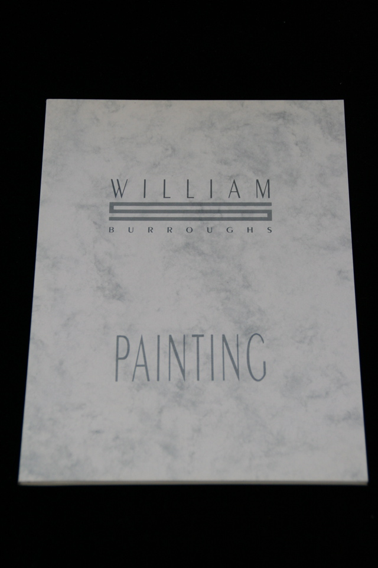

## William S. Burroughs, James Grauerholz. William Burroughs: Painting.

Amsterdam: Suzanne Biederberg Gallery, 1988. First. Brochure accompanying exhibitions in Amsterdam and London. With reproductions of 16 paintings and "On Burroughs' Art", an essay by James Grauerholz, including explication of each piece. Schottlaender B3.

