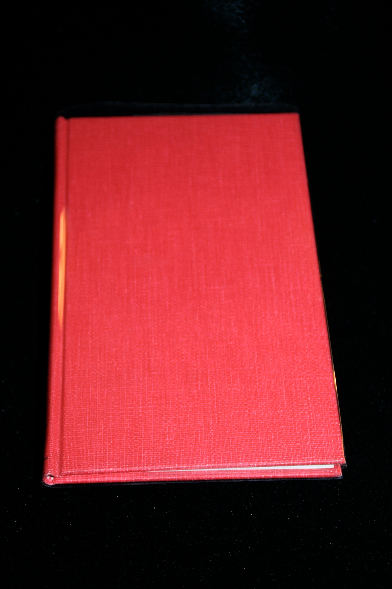

## Goodman, Michael B.. William S. Burroughs: An Annotated Bibliography of his Works and Criticism.

New York: Garland Reference Library of the Humanities, 1975. First. A bibliography compiled by Michael B. Goodman of SUNY, Stony Brook, predating the publication of Maynard and Miles. Without dust jacket as issued. Schottlaender I3.

