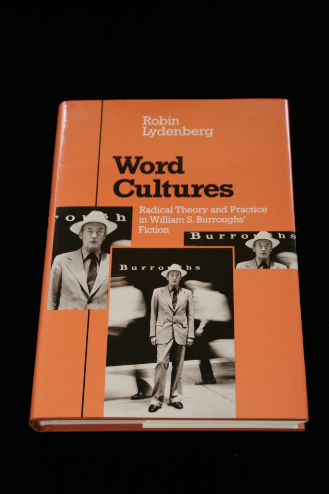

## Robin Lydenberg. Word Cultures: Radical Theory and Practice in William S. Burroughs’ Fiction..

Urbana, IL : University of Illinois Press, 1987. First. Critical study by Robin Lydenberg. Schottlaender I37.

