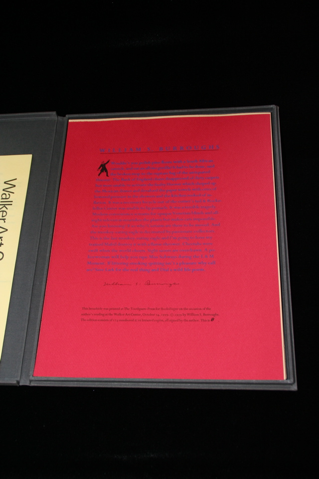

## William S. Burroughs. Wouldn't You Polish Pine Floors....

St Paul, MN: Bookslinger, 1979. First. Signed by Burroughs, lettered B of 26. Broadside, 10x13", in "16 Broadsides" from Walker Art Center Reading Series 1979-1980, Minneapolis, Minnesota. All 16 in complete set. In clamshell box. Schottlaender A45.

