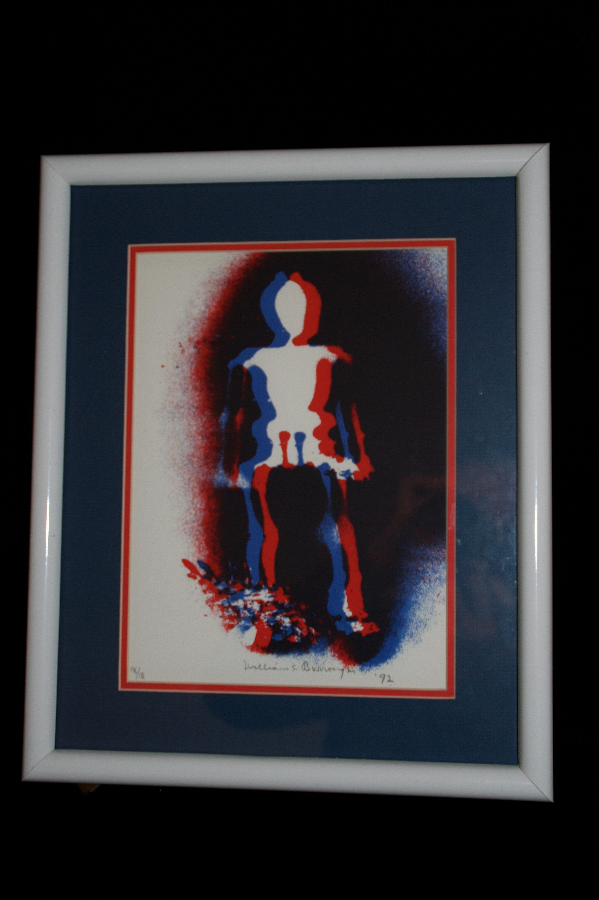

## William S. Burroughs. X-Ray Man.

New York: Water Row/Lococo Mulder, 1991. Per Eric Shoaf, "untitled three-color broadside (red, blue & purple on white background). 9.5 x 13 inches silkscreen print with small embossed lizard figure in lower right corner." Signed by Burroughs. Limited edition printing, number 136 of 178. In original matte and frame. 

